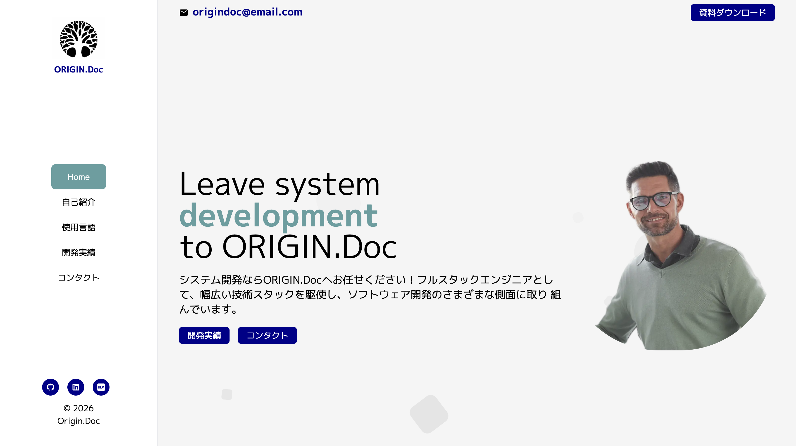
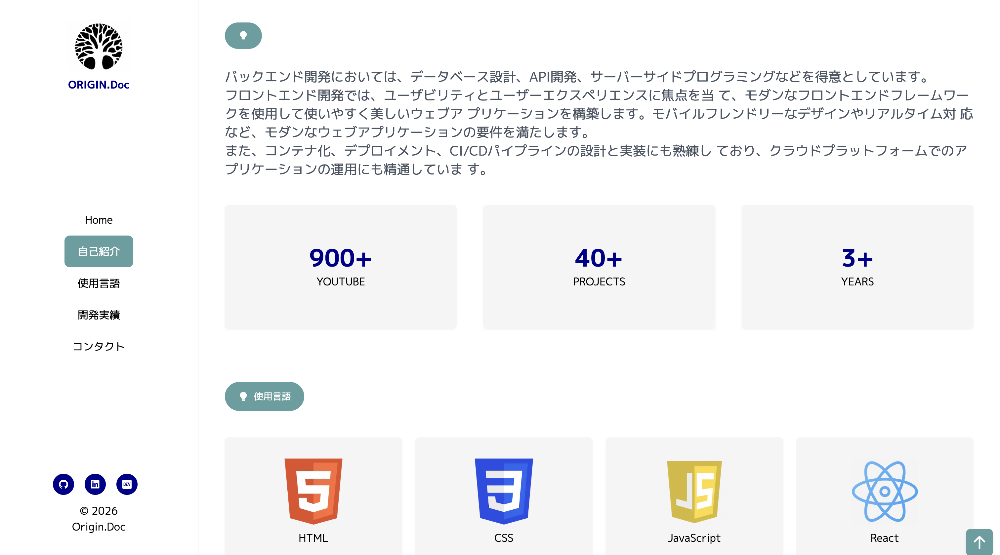
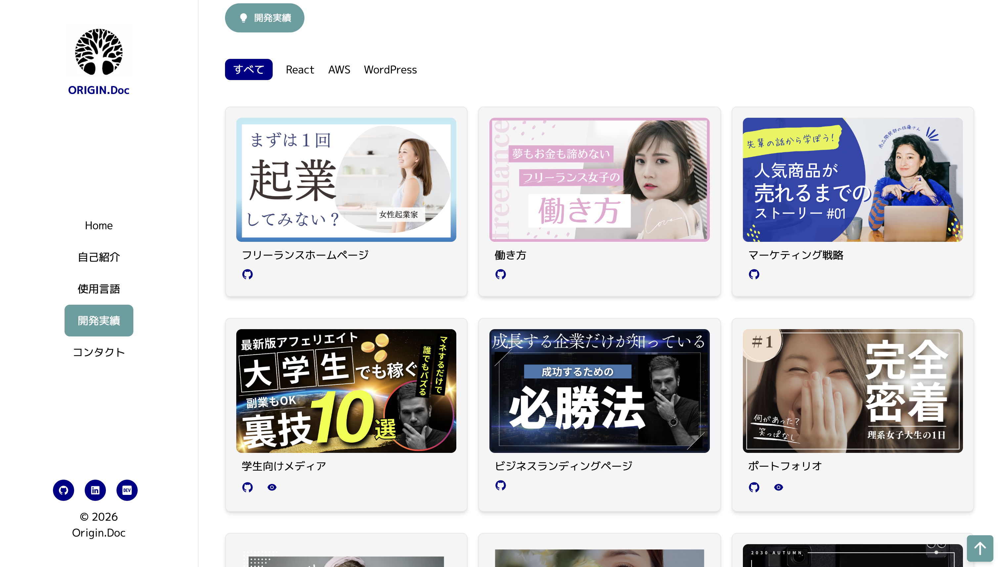
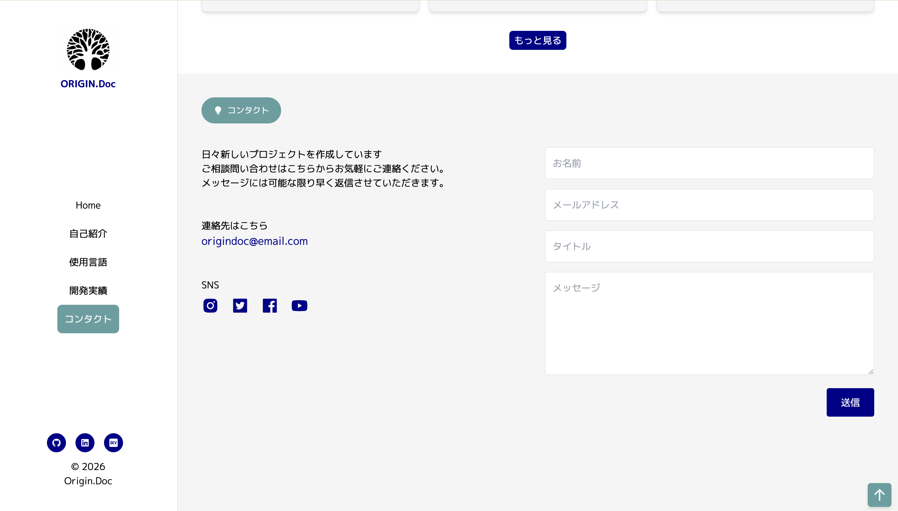

# Origin Doc Portfolio（Udemy）

このプロジェクトは、Next.js 14 の App Router で実装したシングルページのポートフォリオサイトです。ヒーロー、自己紹介、スキル、プロジェクト、お問い合わせ、フッターを縦に並べ、左の固定サイドメニューとヘッダーから各セクションへスムーズに移動できます。モバイルではメニューの開閉を Zustand で管理します。プロジェクトは定数ファイルから表示し、カテゴリ別フィルタ・表示件数の切り替え、Framer Motion によるアニメーションを採用しています。お問い合わせフォームは EmailJS 経由で送信します。見た目は Tailwind CSS とカスタムカラー、ヒーロー用の CSS アニメーション、Google Fontsの M PLUS 1p で構成しています。ナビと案件は constants 配下で一元管理し、サイドメニューはスクロール位置に応じて現在地を表示します。






[Next.js](https://nextjs.org/)（App Router）で構築したシングルページのポートフォリオサイトです。[`create-next-app`](https://github.com/vercel/next.js/tree/canary/packages/create-next-app) で初期化されています。

## 開発の始め方

開発サーバーを起動します。

```bash
npm run dev
```

ブラウザで [http://localhost:3000](http://localhost:3000) を開くと表示を確認できます。

`app/page.js` や `components/` 内のファイルを編集すると、保存時に画面が更新されます。

フォントは [`next/font`](https://nextjs.org/docs/basic-features/font-optimization) で **M PLUS 1p**（Google Fonts）を読み込んでいます。

## よく使うコマンド

| コマンド        | 説明             |
| --------------- | ---------------- |
| `npm run dev`   | 開発サーバー起動 |
| `npm run build` | 本番用ビルド     |
| `npm run start` | 本番サーバー起動 |
| `npm run lint`  | ESLint 実行      |
